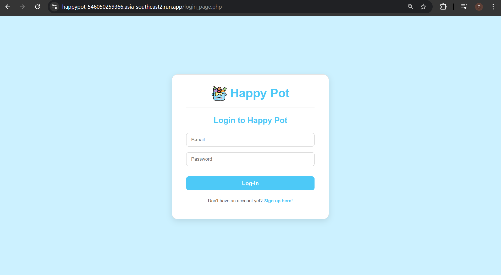

# 🍽️ Happy Pot
Happy Pot adalah aplikasi web yang berfungsi sebagai platform bagi penggemar makanan untuk menemukan, membaca, dan mengunggah resep makanan. Aplikasi ini menyediakan fitur utama untuk interaksi yang dipersonalisasi dan pengalaman berbagi kuliner.


Fitur Utama:
- Recipe Browsing: Menjelajahi berbagai resep dengan instruksi dan bahan terperinci.
    
- User Registration and Login: Autentikasi pengguna yang aman untuk interaksi yang dipersonalisasi.
    
    
- Upload Recipe: Pengguna dapat mengunggah resep mereka sendiri ke situs web.
    
- Commenting System: Menulis dan membaca komentar pada resep untuk berbagi tips dan umpan balik.
    

# 💻 Teknologi yang Digunakan
- Frontend: HTML, CSS, JavaScript
- Backend: PHP
- Database: MySQL (dikelola melalui Google Cloud SQL di lingkungan produksi)
- Web Server: Apache (terkonfigurasi dalam Docker)
- Version Control: GitHub 
- Containerization: Docker 
- Cloud Provider: Google Cloud Platform (GCP) 
- Container Orchestrator: Cloud Run 
- CI/CD: GitHub Actions 
- Testing: PHPUnit 
- Monitoring: Cloud Run

# ⚙️ Requirements
Untuk menjalankan proyek ini secara lokal, Anda memerlukan:
- Docker Desktop: Untuk membangun dan menjalankan aplikasi serta database dalam container. Pastikan Docker Engine berjalan dengan baik di sistem Anda.
- Git: Untuk mengelola versi kode sumber dan berinteraksi dengan GitHub.
- Composer: Manajer dependensi untuk PHP.

# 🚀 Cara Setup di Lingkungan Lokal
Ikuti langkah-langkah berikut untuk menjalankan aplikasi secara lokal menggunakan Docker:

1. Clone Repository
Pertama, clone repositori proyek ke mesin lokal Anda dan masuk ke direktorinya:
``` bash
git clone https://github.com/HappyPot-PSO/happypot.git
cd happypot
```

2. Pastikan File Database Ada
Pastikan file ```recipedb.sql``` berada di direktori yang sama dengan ```docker-compose.yml``` File ini akan digunakan untuk menginisialisasi skema database MySQL Anda.

3. Jalankan Aplikasi dengan Docker Compose
Dari direktori root proyek Anda (tempat ```docker-compose.yml``` berada), jalankan perintah berikut:
``` bash
docker-compose up -d
```
Perintah ini akan melakukan beberapa hal secara otomatis:
- Membangun image Docker untuk aplikasi web (PHP + Apache) jika belum ada atau jika ada perubahan pada ```Dockerfile```.
- Membuat dan menjalankan container untuk aplikasi web (```happypot-app```) dan database MySQL (```happypot-db```).
- Memetakan port aplikasi 80 di dalam kontainer ke port ```8080``` di mesin lokal Anda.
- Mengimpor ```recipedb.sql``` ke dalam database MySQL secara otomatis saat container database pertama kali diinisialisasi.

4. Akses Aplikasi
Setelah container berjalan, Anda dapat mengakses aplikasi Happy Pot melalui browser Anda di:
``` bash
http://localhost:8080.
```

# 🧪 Cara Menjalankan Linter / Unit Test di Lingkungan Lokal
Proyek ini menggunakan PHPUnit untuk unit testing dan Composer untuk mengelola dependensi, serta tools untuk memeriksa kualitas kode.

1. Instal Dependensi Composer:
Pastikan Anda sudah berada di direktori root proyek Anda, lalu jalankan:
``` bash
composer install
```

2. Jalankan Validasi Composer
``` bash
composer validate --strict
```

3. Jalankan PHPUnit Tests:
``` bash
./vendor/bin/phpunit
```

5. Jalankan PHP Code Sniffer (Linter):
``` bash
./vendor/bin/phpcs --standard=PSR12 --extensions=php .
```

7. Jalankan PHP Mess Detector (Code Quality Analysis):
``` bash
./vendor/bin/phpmd . text cleancode,codesize,controversial,design,naming,unusedcode
```

# ➕ Cara Menambahkan Fitur Baru
Proyek ini mengikuti alur kerja Git standar untuk pengembangan fitur. Ikuti langkah-langkah berikut untuk menambahkan fitur baru atau melakukan perbaikan:

1. Buat Branch Baru:
``` bash
git checkout main
git pull origin main
git checkout -b nama-fitur-baru-anda
```

2. Kembangkan Fitur & Lakukan Commit:
Setelah Anda selesai mengembangkan fitur atau perbaikan, tambahkan perubahan dan buat commit:
``` bash
git add .
git commit -m "Menambahkan Fitur"
```

3. Dorong Branch ke GitHub:
``` bash
git push origin nama-fitur-baru-anda
```

4. Buat Pull Request
Buka GitHub dan buat Pull Request (PR) dari branch baru Anda ```(nama-fitur-baru-anda)``` ke branch ```main```. Berikan deskripsi yang jelas tentang fitur yang Anda tambahkan.

5. Review Kode & Merge:
Setelah code review selesai dan disetujui, PR Anda akan digabungkan ke branch ```main```. Penggabungan ke main akan secara otomatis memicu _pipeline Continuous Deployment (CD)_ untuk _deploy _perubahan.

# 🌐 Public URL 
Anda dapat mengakses aplikasi melalui URL publik berikut:
``` bash
https://happypot-546050259366.asia-southeast2.run.app
```

# 📝 License
Proyek ini merupakan hasil _forking_ dari repositori berikut: https://github.com/xritzia/Simple-Recipe-Website


Terima kasih telah menjelajahi proyek Happy Pot! Kami harap dokumentasi ini membantu Anda memulai dan memahami aplikasi kami.